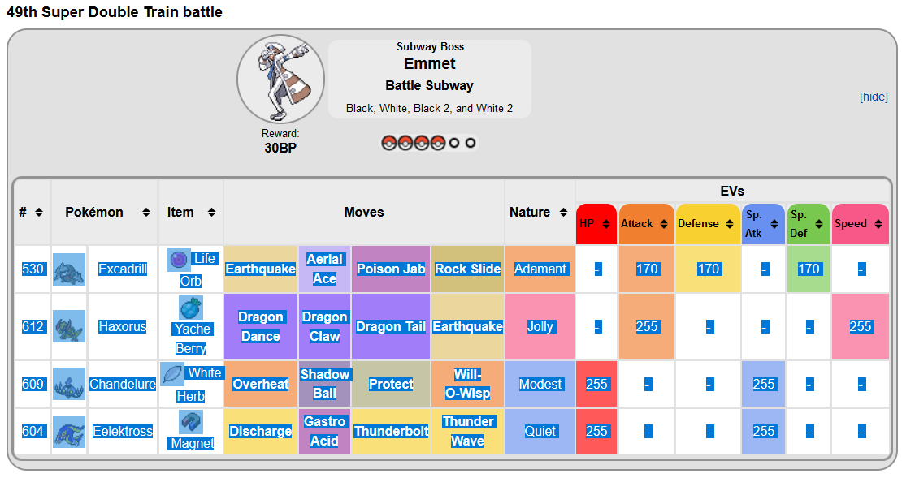
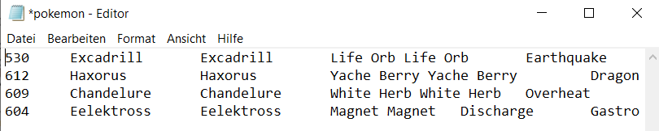
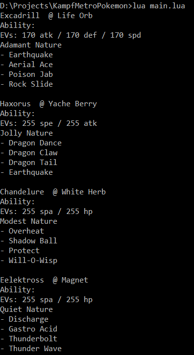

# bulbapedia-pokemon-parser
Parses Pokemon from Bulbapedia into PokemonShowdown format

# usage
copy the table of pokemon from a bulbapedia page 

and paste it into pokemon.txt


```shell
lua main.lua
```
copy or look at the pokemon in the pokemon showdown format



